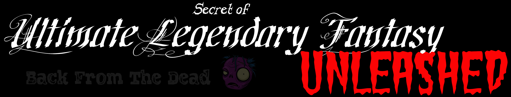
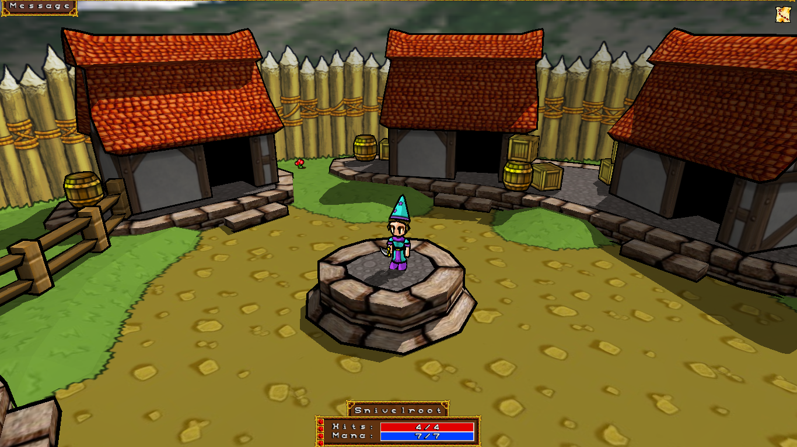

# SoulFu Development Team

**SoulFu** ( *Secret of Ultimate Legendary Fantasy Unleashed* ) is an open-source 3D arcade/RPG/roguelike by Aaron Bishop. The official site can be found [here](http://www.aaronbishopgames.com/).

While the game fostered a small community several years ago, it unfortunately never gained enough popularity to sustain long-term development. The original *niceware* license created hosting hurdles on platforms like SourceForge, and the game's specific architecture discouraged new developers. Key challenges included:

+ **Closed ecosystem**: game resources are stored in a single binary archive that can only be modified using internal tools. This makes sharing code changes between developers problematic,
+ **Proprietary formats**: most file formats - including scripts, 3D models, and language files - are custom-made - making them incompatible with standard external editing tools,
+ **Portability issues**: the original source code was designed strictly for 32-bit platforms, leading to significant compatibility issues on modern systems,
+ **Modified dependencies**: the code relied on modified versions of external libraries, which complicated efforts needed to port the game to other environments.

To address these hurdles, I have applied various patches from the community and developed an external toolset designed to simplify modding and development. My primary objective was to make the game's codebase more modular and shareable, which I believe has been achieved to a significant degree.

-- szymor

